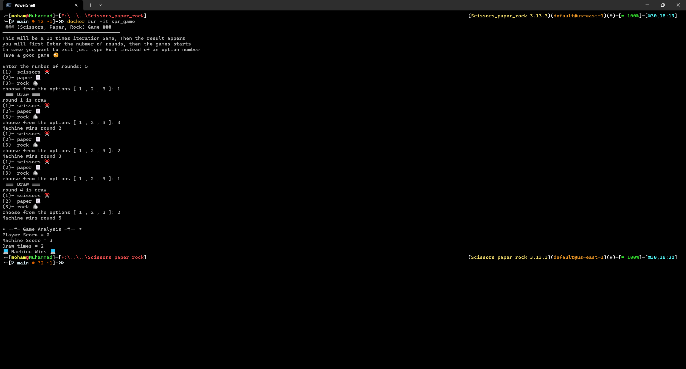

# python_games
CLI Games in python, main purpose is to apply Venv(Virtual Environment) for each game and Dockerize each game

If u r going to clone this repo make sure to install Venv on your machine

* Scissors - Paper - Rock game

Activae the Venv, create Dockerfile, then, build the image

   

Run the game image container
   